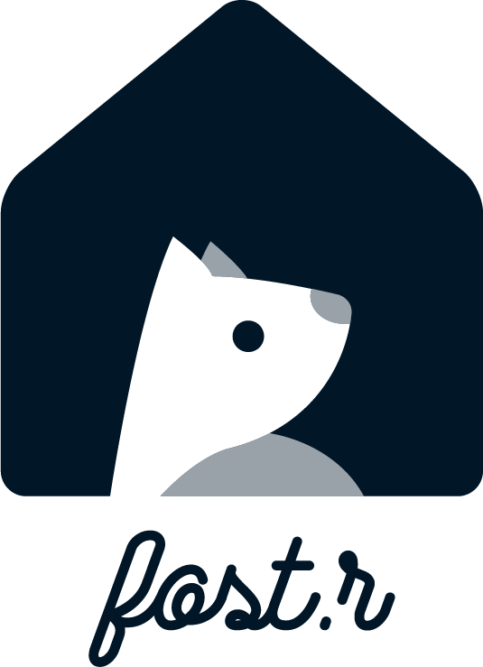

<h1 align="center">
	
	<br />
	fost.r Client
	<br />
	
	<a href=""></a>
	<a href="https://facebook.github.io/react/"></a>
	<br />
</h1>
<h4 align="center">Raise awareness on homeless animals because of neglect or abuse</h4>

### Installation
1. Have the latest version of [yarn](http://www.yarnpkg.com/).
2. Clone this repository.
3. Install all the dependencies using `yarn install`.
4. Run the [API server](https://github.com/rrsilaya/fost.r-backend).
5. Start the react app with `yarn start`.

It is assumed that you are using [yarn](http://www.yarnpkg.com/) as your package manager. To use [npm](https://www.npmjs.com/), do:
```
$ npm install && npm start
```

### Technologies Used
* [ReactJS](https://facebook.github.io/react/)
* [Redux (React Redux)](https://redux.js.org/)
* [UIkit](https://getuikit.com/)
* [MomentJS](https://momentjs.com/)
* [Axios](https://github.com/mzabriskie/axios)

### Features
1. **Adopt** - adopt from pets offered by different animal shelters 
2. **Date** - experience being with a pet in a day
3. **Connect** - connect with the community of animal lovers and experts
4. **Rescue** - file a rescue request on animals experiencing neglect or abuse

### Project Structure
```
.
├── node_modules
├── public
│   ├── index.html
│   └── manifest.json
├── src
│   ├── app
│   │   ├── components                  # global components
│   │   │   ├── Main.js                 # main component, handles rendering of pages
│   │   │   └── Navigation.js           # navigation bar
│   │   ├── ducks                       # folder for all ducks*
│   │   │   └── auth.js
│   │   ├── pages                       # 'page' components of app
│   │   │   ├── page1
│   │   │   │   ├── <PageContainer>.js  # container component of page
│   │   │   │   └── <Page>.js           # presentational component of page
│   │   │   ├── AnonUser.js             # handles routes for unauthenticated users
│   │   │   └── LoggedIn.js             # handles routes for logged in users
│   │   ├── AppContainer.js
│   │   ├── App.js
│   │   └── store.js                    # redux store, handles app state
│   ├── assets
│   │   ├── css                         # folder for the app's stylesheets
│   │   │   ├── <componentStyle>.css    # specific component stylesheet
│   │   │   ├── index.css               # global stylesheet
│   │   │   └── uikit.min.css           # framework stylesheet
│   │   ├── fonts
│   │   │   ├── <font>.eot
│   │   │   ├── <font>.svg
│   │   │   ├── <font>.ttf
│   │   │   └── <font>.woff
│   │   └── images
│   │       └── section-background.svg  # framework image dependency
│   └── index.js
├── package.json
├── README.md
└── yarn.lock
```

### Developers
This web app is part of the PAD project of Batch o(ctal) in Young Software Engineers' Society (YSES) UPLB.
##### API
* Evangelista, Erlen Mae
* Sombaes, Kia Mei

##### Client
* Gotis, Ciara Mae
* Silaya, Ralph Lawrence
